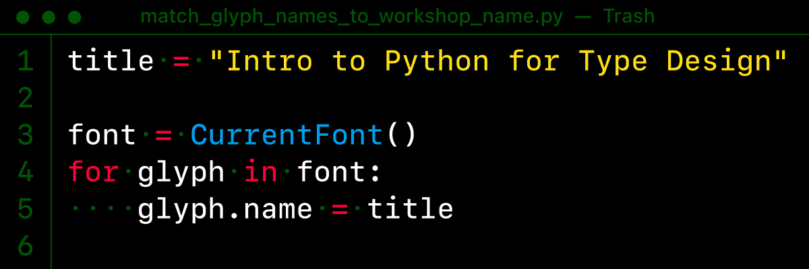
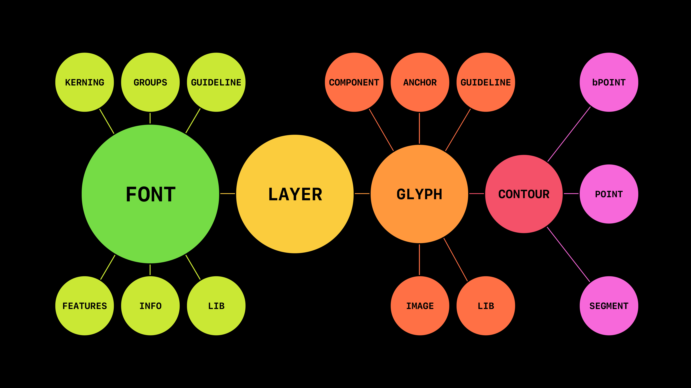
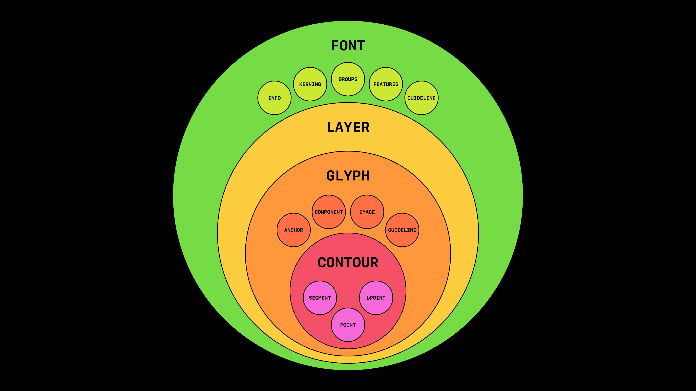

# Python Workshops

This repository is a centralized place for all Intro to Python [workshops at Type@Cooper](https://coopertype.org/workshops/), led by [Ryan Bugden](https://ryanbugden.com). 

## Materials from Python workshops:
- Example code
- Presentations & notes
- Resources & links (below)

---

### Resources:
- [DrawBot](https://drawbot.com/content/shapes/primitives.html) API, for scripting in DrawBot
- [FontParts](https://fontparts.robotools.dev/en/stable/objectref/objects/index.html) API, for scripting with UFO files
- [Scripting in RoboFont](https://robofont.com/documentation/reference/fontparts/), specifically
- [Scripting in Glyphs](https://glyphsapp.com/learn/scripting-glyphs-part-1), specifically
- [Python for Designers](https://pythonfordesigners.com/), by Roberto Arista
- [mojo.UI](https://robofont.com/documentation/reference/api/mojo/mojo-ui/?highlight=mojo.ui): very simple tools for simple UI interactions in RoboFont

### Illustrations of FontParts 
For students’ quick reference, I am including my rendition of the [FontParts object map](https://fontparts.robotools.dev/en/stable/objectref/objects/index.html), as well as a new hierarchical representation of the objects’ relationship to one another.

#### The map

#### The hierarchy

### Scripts & Extensions
- [RoboFont Mechanic](https://robofontmechanic.com/): an extension that gives you quick access to other extensions.
- [RoboFont Script Database](https://scripts.robofontmechanic.com/): a collection of little scripts for RoboFont.

### Extra resources:
- [DrawBot Proofing](https://github.com/adobe-type-tools/drawBotProofing), by Frank Grießhammer & Josh Hadley
- [Basics of Unicode in Python](https://gist.github.com/arrowtype/713dad14fe9a574d58d1aab61ba9b2f0), by Stephen Nixon & others
- [DrawBot Grid](https://github.com/mathieureguer/drawbotgrid), by Mathieu Reguer
- [Proof Generator](https://github.com/grillitype/ProofGenerator), by Grilli Type

### Acknowledgments:

*Highly influenced by [Ben Kiel’s](https://github.com/benkiel/python_workshops/tree/master) and [Andy Clymer’s](https://github.com/andyclymer/pythonworkshop) repositories for teaching Python*.
